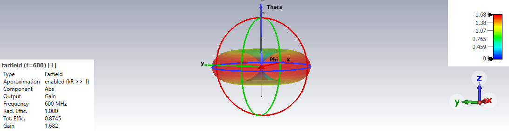
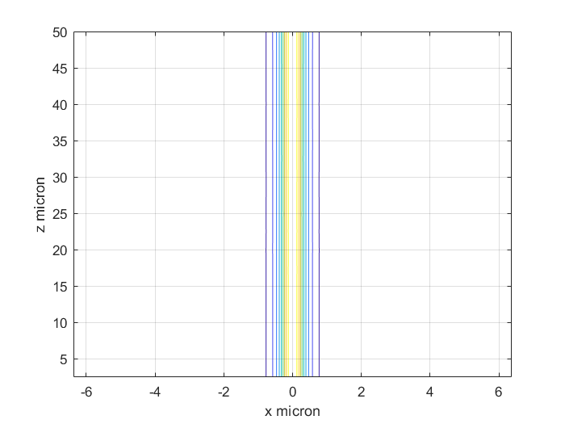
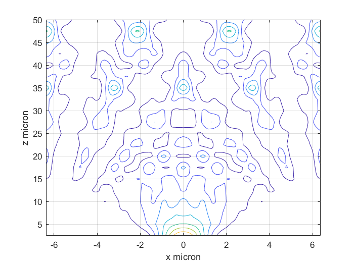
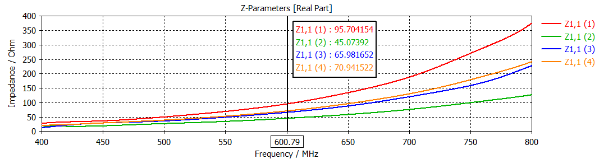
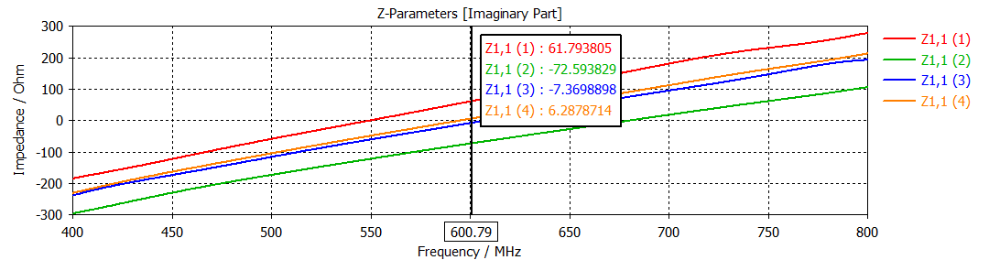

# Computational Electromagnetism: Waveguides and Antennas

*Radiation solid of a half-wavelength dipole antenna simulated in CST Studio Suite, showing the characteristic omnidirectional pattern.*

---

## 📖 Table of Contents

-   [1. Project Overview](#1-project-overview)
-   [2. Exercise 1: Wave Propagation in Slab Waveguides](#2-exercise-1-wave-propagation-in-slab-waveguides)
    -   [FFT-BPM and FD-BPM Analysis](#fft-bpm-and-fd-bpm-analysis)
    -   [FDM Modal Solver for TE/TM Modes](#fdm-modal-solver-for-tetm-modes)
-   [3. Exercise 2: Rectangular Waveguide Analysis in CST](#3-exercise-2-rectangular-waveguide-analysis-in-cst)
-   [4. Exercise 3: Coaxial Cable Analysis in CST](#4-exercise-3-coaxial-cable-analysis-in-cst)
-   [5. Exercise 4: Half-Wavelength Dipole Antenna](#5-exercise-4-half-wavelength-dipole-antenna)
-   [6. Technologies Used](#6-technologies-used)
-   [7. How to Explore the Project](#7-how-to-explore-the-project)

---

## 1. Project Overview

This repository contains a collection of projects and simulations developed for a course in Computational Electromagnetism. The work covers fundamental concepts ranging from wave propagation in dielectric waveguides to the analysis of microwave components and antenna radiation.

The project is divided into four main exercises:
1.  **Slab Waveguide Simulation (MATLAB):** Implementation of numerical methods (FFT-BPM, FD-BPM, FDM) to analyze propagation and modal content in planar waveguides.
2.  **Rectangular Waveguide (CST):** Modal analysis of a hollow rectangular waveguide to determine cutoff frequencies for TE modes.
3.  **Coaxial Cable (CST):** Study of the fundamental TEM mode and higher-order TE modes in a coaxial structure.
4.  **Dipole Antenna (CST):** Comprehensive analysis of a half-wavelength dipole antenna in both transmitting and receiving modes.

---

## 2. Exercise 1: Wave Propagation in Slab Waveguides

This exercise, implemented entirely in **MATLAB**, focuses on the numerical simulation of a symmetric slab waveguide.

### FFT-BPM and FD-BPM Analysis

We implemented and compared two Beam Propagation Methods (BPM) to simulate the propagation of the fundamental TE mode:
-   **FFT-BPM (Fast Fourier Transform BPM):** A spectral method that leverages the efficiency of the FFT algorithm.
-   **FD-BPM (Finite Difference BPM):** A method that discretizes the wave equation in the spatial domain.

Key findings include the critical role of the **thin lens law operator** for modeling the guiding effect and the superiority of **Transparent Boundary Conditions (TBC)** over Neumann conditions for preventing artificial reflections.

| Propagation with Thin Lens (FFT-BPM)         | Propagation without Thin Lens (FFT-BPM)            |
| ---------------------------------------------- | -------------------------------------------------- |
|  |  |

### FDM Modal Solver for TE/TM Modes

A modal solver based on the **Finite Difference Method (FDM)** was developed to find the effective indices and field profiles of the guided modes. The code solves the Helmholtz equation as a matrix eigenvalue problem for both **Transverse Electric (TE)** and **Transverse Magnetic (TM)** polarizations. The analysis was performed at different wavelengths, demonstrating the transition from multi-mode to single-mode operation as the wavelength increases.

*Computed field profile for the fundamental TE mode at λ = 1.0 µm.*

---

## 3. Exercise 2: Rectangular Waveguide Analysis in CST

This exercise uses **CST Studio Suite** to perform a modal analysis of a hollow rectangular waveguide with Perfect Electric Conductor (PEC) walls. The simulation identifies the cutoff frequencies for the first few TE modes. The results were analyzed for both a vacuum-filled guide and a Teflon-filled guide, demonstrating how the dielectric material lowers the cutoff frequencies.

| Mode         | Cutoff Frequency (Vacuum) | Cutoff Frequency (Teflon) |
| :----------- | :------------------------ | :------------------------ |
| **TE₁₀**     | 5.0 GHz                   | 3.5 GHz                   |
| **TE₂₀**     | 10.0 GHz                  | 6.9 GHz                   |
| **TE₀₁**     | 12.5 GHz                  | 8.6 GHz                   |
| **TE₁₁**     | 13.5 GHz                  | 9.3 GHz                   |

---

## 4. Exercise 3: Coaxial Cable Analysis in CST

Here, we analyzed a coaxial cable, a structure that supports a **Transverse Electro-Magnetic (TEM)** fundamental mode.

-   **Fundamental TEM Mode:** This mode has no cutoff frequency and features radial electric field lines and circular magnetic field lines. It behaves like a uniform plane wave, and its impedance is determined by the dielectric material (Teflon).
-   **Higher-Order TE₁₁ Mode:** The first higher-order mode was identified as TE₁₁, with a cutoff frequency of **3.39871 GHz**. This frequency defines the upper limit for unimodal operation of the coaxial cable.

The simulation of surface currents confirmed that for the TEM mode, current flows longitudinally along the inner conductor and the inner surface of the shield.

---

## 5. Exercise 4: Half-Wavelength Dipole Antenna

This comprehensive exercise analyzes a half-wavelength dipole antenna operating at a center frequency of 600 MHz using the FDTD solver in CST.

### Transmitting Mode Analysis
-   **Radiation Pattern:** The simulation confirms the iconic donut-shaped radiation solid, which is omnidirectional in the plane orthogonal to the antenna axis. The calculated directivity of 1.682 is close to the theoretical value.
-   **Input Impedance:** We analyzed the input impedance and optimized the antenna's length slightly to achieve resonance (zero imaginary part), which improved the total efficiency by ensuring better matching with the 75 Ω generator.

| Real Impedance vs. Frequency            | Imaginary Impedance vs. Frequency         |
| --------------------------------------- | ----------------------------------------- |
|  |  |

### Receiving Mode Analysis
-   **Reciprocity:** The antenna's behavior as a receiver was simulated by exciting it with a plane wave.
-   **Polarization Sensitivity:** We demonstrated the antenna's polarization sensitivity by rotating the incident plane wave's polarization. The induced voltage at the antenna's gap correctly follows a cosine law, being maximum when the E-field is aligned with the dipole and zero when it is orthogonal.

*Plot showing the received voltage as a function of the incident wave's polarization angle, confirming the cosine-law dependency.*

---

## 6. Technologies Used

-   **Simulation Software:**
    -   MATLAB
    -   CST Studio Suite
-   **Numerical Methods:**
    -   Finite Difference Method (FDM)
    -   Finite Difference Time Domain (FDTD)
    -   Beam Propagation Method (BPM)
-   **Documentation:**
    -   LaTeX

---

## 7. How to Explore the Project

-   **MATLAB Scripts:** The MATLAB code for Exercise 1 can be found in the `es1/` subdirectories. Each script is self-contained and can be run to reproduce the results.
-   **CST Analysis:** The results from CST Studio Suite (Exercises 2, 3, and 4) are presented as screenshots and data plots. The original `.cst` project files are not included in this repository due to their large size.
-   **Full Report:** A detailed PDF report, generated from the provided LaTeX source file, offers an in-depth theoretical background and analysis for all exercises.
